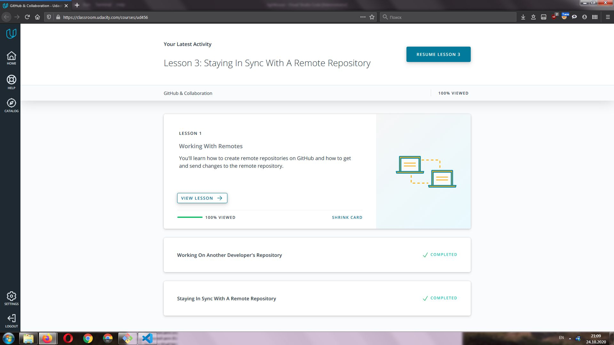

# kottans-frontend
kottans frontend course repository

## 1. Git and GitHub

I work with GIT earlier using GUI extensions Visual Studio Code, so I was familiar with the topics. 
Still, in this section I learned some GIT commands.
Not sure whether I will use them in my work every day or not, but I think its useful to know them.

Show all branches graph: ` git log --oneline --decorate --graph --all `

## 2. Linux CLI and Networking

I dont use Linux, so this material was completely new for me, except commands that is the same in Windows. Most interesting for me was disc partition.

Useful things: 
 - slash "/" at the start path is root, path without - relative
 - ~ - home directory
 - r w x - read write execute, user - group - world
 - \> - overwrite, >> - append
 - | - sends the output of a command as the input to another command

Main commands:

- `ls` - show content of folder
- `mkdir` - create directory
- `mv` - move file or rename
- `more` - Display the contents of a file
- `cd` - change directory
- `pwd` - print working directory
- `cp` - copy files
- `rm` - remove file
- `rmdir` - remove folder
- `chmod` - change the security permissions on files
- `groups` - get a listing of your group memberships
- `man` - manual
- `find` - find content
- `cat` - combine files
- `finger` - show user information
- `lpr` - send to printer
- `lpq` - display print queue
- `lprm` - remove from print queue
- `df` - disk usage listing
- `ps aux` - get a detailed list of all processes
- `kill` - close process

## 3. Git Collaboration

In this section I learned a lot about remotes, linking remotes to local branches. Interesting capability define sourse and destination for fetch, push, pull.

## 4. Intro to HTML and CSS
This courses teach some basics, so I dont really learn something new, but helped me better remember details.

## 5. Responsive Web Design

This course had a lot new for me. I learned about main responsive patterns. 
Interesting info:
- for readability the good length of a line of text 45-90 characters and 65 for web.
- tap targets must be not less than 48*48px 

Responsive patterns: 
- column drop
- mostly fluid
- layout shifter
- off canvas

Responsive tables:
- hidden colums
- no more tables
- contained tables

## 5. HTML & CSS practice: Hooli-style Popup

Working at this task I learned some things about accessibility. Surprized me that label trigger linked input only on mouse click, but not keyboard. 

[demo](https://vbystrov.github.io/html-css-popup/index.html)
[code](https://github.com/VBystrov/html-css-popup)

## 6. JS Basics

In this chapter i repeated JS basics.  freecodecamp  tasks was really cool, some of them made me think a lot for solution.

What surprised:

splice with only first parameter will delete elements from *start* to the end of array, this case was not even described at w3schools.

arr.splice(*start*);

## 7. DOM

Some notes about new things I learned:

##### Text
Node.textContent - represents the text content of the node and its descendants.

Element.innerHTML - gets or sets the HTML or XML markup contained within the element.

HTMLElement.innerText - represents the "rendered" text content of a node and its descendants. 

Interesting difference between innerText and textContent - the elements that are not rendered are also not present in innerText and the line breaks in innerText follow the line breaks that were introduced by layout (not the original text we stuffed in the DOM).
Preferable use textContent because of better performance.

##### Events
.removeEventListener() method requires you to pass the same exact listener function to it as the one you passed to .addEventListener().

There are three different phases during the lifecycle of an event. They are:
 - the capturing phase
 - the at target phase
 - and the bubbling phase

##### State
Hover, focus, and active states should be styled different.
the best way to order your pseudo-class styles are :hover then :focus then :active

